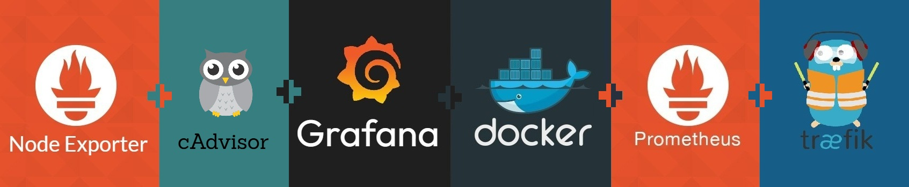
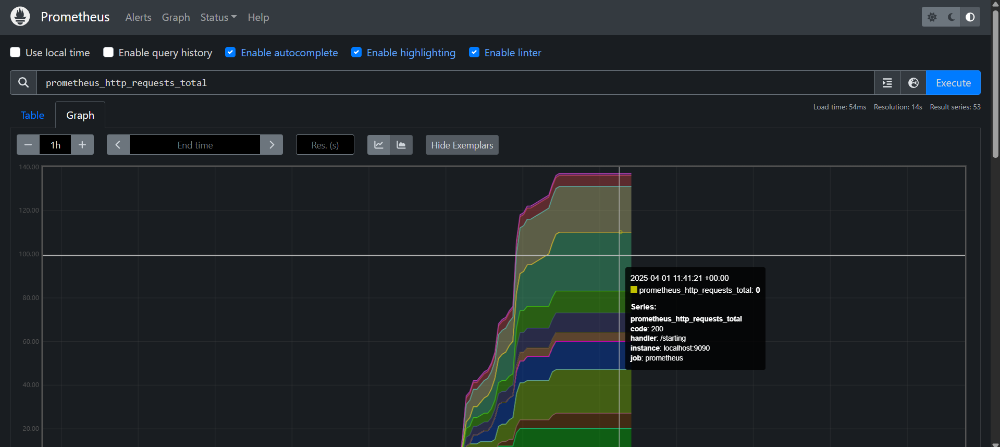

<h1 id="top" align="center">Core Prometheus</h1>

<br>

<div align="center">
    
</div>

<br>

## 🔍 Table of Contents

- [About Project](#intro)
- [Dashboard](#dashboard)
- [Technologies](#technologies)
- [Features](#features)
- [Releases](#releases)
- [System Startup](#system-startup)
- [Contributors](#contributors)

<br/>

<h2 id="intro">📌 About Project</h2>

This project simplifies the deployment of Prometheus with pre-configured settings, including persistent data storage and integration with Traefik metrics for monitoring reverse proxy performance, all managed via Docker Compose.

<br/>

<h2 id="dashboard">🔥 Dashboard</h2>

<div align="center">
    
</div>

<br/>

<h2 id="technologies">☄️ Technologies</h2>

&nbsp; [](https://www.docker.com/)

&nbsp; [](https://prometheus.io)

<br/>

<h2 id="features">🔥 Features</h2>

- **Docker Containerization:** The application is containerized using Docker to ensure consistent deployment, scalability, and isolation across different environments.
- **Persistent Data:** Utilizes bind mounts to persist data on the host machine, preventing data loss during container restarts.
- **Docker Compose Deployment:** Simplifies deployment with Docker Compose configuration, enabling easy setup and service orchestration without complex commands.
- **Customizable Configuration:** Easily modify Prometheus configuration via bind mounts to adjust settings such as scrape intervals, alert rules, and more.
- **Traefik Metrics Integration:** Prometheus can be configured to scrape metrics provided by Traefik, enabling monitoring of your reverse proxy's performance, request counts, error rates, and other important statistics. This helps to get a comprehensive view of your application's traffic and routing.

<br/>

<h2 id="releases">🚢 Releases</h2>

&nbsp; [](https://github.com/ahmettoguz/core-prometheus/tree/v1.0.0)

<br/>

<h2 id="system-startup">🚀 System Startup</h2>

- Create a new directory named `core`.

```
mkdir core
cd core
```

- Clone project.

```
git clone https://github.com/ahmettoguz/core-prometheus
```

- Create `network-core` network if not exists.

```
docker network create network-core
```

- Run Container.

```
docker stop                           core-prometheus-c
docker rm                             core-prometheus-c
docker compose -p core up --build -d  prometheus
docker compose -p core up -d          prometheus
docker logs -f                        core-prometheus-c
```

- Test connection.

```
curl -vkL https://micro-local.net/prometheus/api/v1/query?query=up
curl -vkL https://micro-local.net/prometheus/api/v1/metadata
```

- Check [`grafana`](https://github.com/ahmettoguz/core-graphana) repository to integrate gaphana to visualize prometheus data.

<br/>

<h2 id="contributors">👥 Contributors</h2>

<a href="https://github.com/ahmettoguz" target="_blank"></a>

### [🔝](#top)
