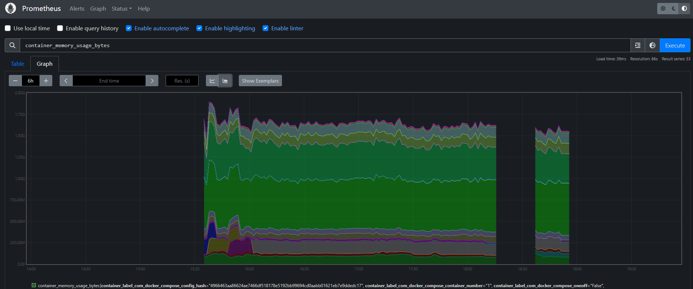

<h1 id="top" align="center">Monitor Prometheus</h1>

<br>

<div align="center">
    
</div>

<br>

## 🔍 Table of Contents

- [About Project](#intro)
- [Dashboard](#dashboard)
- [Technologies](#technologies)
- [Features](#features)
- [Releases](#releases)
- [System Startup](#system-startup)
- [Contributors](#contributors)

<br/>

<h2 id="intro">📌 About Project</h2>

This project simplifies the deployment of Prometheus with pre-configured settings, including persistent data storage and integration with Traefik, cAdvisor, and node-exporter to monitor reverse-proxy, docker and system performance and metrics, all managed via Docker Compose.

<br/>

<h2 id="dashboard">🔥 Dashboard</h2>

<div align="center">
    
</div>

<br/>

<h2 id="technologies">☄️ Technologies</h2>

&nbsp; [](https://www.docker.com/)

&nbsp; [](https://prometheus.io)

&nbsp; [](https://www.ibm.com/docs/bg/aix/7.2?topic=files-env-file)

<br/>

<h2 id="features">🔥 Features</h2>

- **Docker Containerization:** The application is containerized using Docker to ensure consistent deployment, scalability, and isolation across different environments.
- **Persistent Data:** Utilizes a named Docker volume to ensure persistent storage of application data, allowing data to persist across container restarts, rebuilds, and removals.
- **Docker Compose Deployment:** Simplifies deployment with Docker Compose configuration, enabling easy setup and service orchestration without complex commands.
- **Configuration:** Preconfigured Prometheus configuration to adjust scrape intervals, alert rules, and more.
- **.env Configuration:** All environment variables are easily configurable using the `.env` file, simplifying configuration management.
- **Traefik Metrics Integration:** Prometheus can be configured to scrape metrics provided by Traefik, enabling monitoring of your reverse proxy's performance, request counts, error rates, and other important statistics. This helps to get a comprehensive view of your application's traffic and routing.
- **cAdvisor Integration:** Integrates with cAdvisor to scrape container metrics and track resource usage (CPU, memory, network, disk) across running containers.
- **Node-Exporter Integration:** Scrapes node metrics, including system-level statistics like CPU usage, memory consumption, disk I/O, and network statistics for overall server health monitoring.

<br/>

<h2 id="releases">🚢 Releases</h2>

&nbsp; [](https://github.com/ahmettoguz/monitor-prometheus/tree/v1.2.1)

&nbsp; [](https://github.com/ahmettoguz/monitor-prometheus/tree/v1.2.0)

&nbsp; [](https://github.com/ahmettoguz/monitor-prometheus/tree/v1.1.0)

&nbsp; [](https://github.com/ahmettoguz/monitor-prometheus/tree/v1.0.0)

<br/>

<h2 id="system-startup">🚀 System Startup</h2>

- Create a new directory named `monitor`.

```
mkdir monitor
cd monitor
```

- Clone project.

```
git clone https://github.com/ahmettoguz/monitor-prometheus
cd monitor-prometheus
```

- Switch version.

```
git checkout v1.2.1
```

- Create `.env` file based on the `.env.example` file with credentails and configurations.

```
cp .env.example .env
nano .env
```

- Create configuration file `./config/prometheus.yml` with reference to one of the following file according to needs:

- `./config/prometheus.all.yml`
- `./config/prometheus.cadvisor.yml`
- `./config/prometheus.node-exporter.yml`
- `./config/prometheus.traefik.yml`

```
cp ./config/prometheus.all.yml ./config/prometheus.yml
```

- Create `network-monitor` network if not exists.

```
docker network create network-monitor
```

- Manage container.

```
docker stop                     container-prometheus
docker rm                       container-prometheus
docker volume rm                volume-prometheus
docker compose -p monitor up -d service-prometheus
docker logs -f                  container-prometheus
```

- Refer to [`cAdvisor`](https://github.com/ahmettoguz/monitor-cadvisor) repository to expose contianer metrics.

- Refer to [`Node-Exporter`](https://github.com/ahmettoguz/monitor-node-exporter) repository to expose node metrics.

- Refer to [`Promtail`](https://github.com/ahmettoguz/monitor-promtail) repository to push traefik access logs to Loki.

- Refer to [`Loki`](https://github.com/ahmettoguz/monitor-loki) repository to scrap traefik access logs from promtail.

- Refer to [`Traefik`](https://github.com/ahmettoguz/proxy-traefik) repository to expose traefik access logs, metrics and also launch reverse proxy.

- Refer to [`Grafana`](https://github.com/ahmettoguz/monitor-grafana) repository to integrate grafana to visualize logs and metrics.

<br/>

<h2 id="contributors">👥 Contributors</h2>

<a href="https://github.com/ahmettoguz" target="_blank"></a>

### [🔝](#top)
